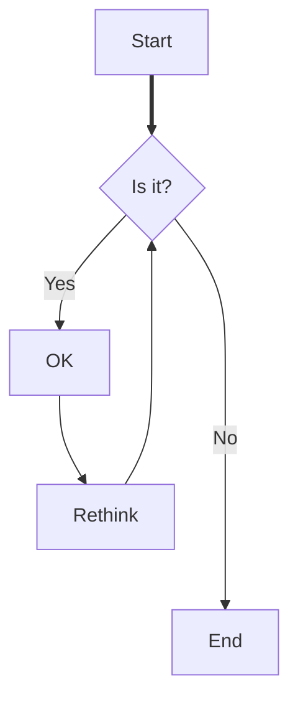

# Markdown

Notice that there are diferent markdown languages.
What markdown laguages are there?

## Text Formating
Testing Markdown

*this is italic*
**this is bold**
***this is bold italic***

`this is boxed line`

## Graphing
There are a lot of possibilirties and options and surely many more will apear and evolve. For the time being *Mermaid* satisfies all my needs.

### Mermaid

Here are a few graphs that I used and than packed with as much diferent formating features as I could think of.

